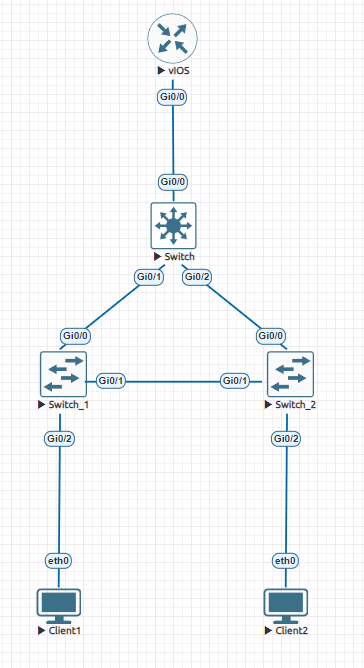

# Лабораторная работа 1

## Общий план



## Описания компонентов

### Client1 и Client2

Клиенты

Задаём им следующую конфигурацию:

```
ip 10.0.10.1/24 10.0.10.117
```

и

```
ip 10.0.20.1/24 10.0.20.117
```

Соответственно.

### Switch1 и Switch2

Коммутаторы доступа

Узлу ```Switch1``` задаём следующую конфигурацию (опуская ```en```, ```conf t``` и ```exit```):

```
vlan 10
vlan 20
interface g0/0
    switchport trunk encapsulation dot1q
    switchport mode trunk
interface g1/0
    switchport trunk encapsulation dot1q
    switchport mode trunk
interface g0/2
    switchport mode access
    switchport access vlan 10
spanning-tree mode pvst
```

Для ```Switch2``` всё тоже самое, только ```switchport access vlan 10``` заменяем на ```switchport access vlan 20```.

### Switch

Ядро сети

Задаём ему следующую конфигурацию:

```
vlan 10
vlan 20
interface g0/0
    switchport trunk encapsulation dot1q
    switchport mode trunk
interface g1/0
    switchport trunk encapsulation dot1q
    switchport mode trunk
interface g0/2
    switchport trunk encapsulation dot1q
    switchport mode trunk
spanning-tree vlan 10 root primary
spanning-tree vlan 20 root primary
```

### vIOS

Маршрутизатор

Задаём ему следующую конфигурацю:

```
interface g0/0.10
    encapsulation dot1Q 10
    ip address 10.0.10.117 255.255.255.0
interface g0/0.20
    encapsulation dot1Q 20
    ip address 10.0.20.117 255.255.255.0
```

## Результаты

- Топология собрана
- ```Client1``` находится во VLAN 10 и сети 10.0.10.1/24, а ```Client2``` - во VLAN 20 и сети 10.0.20.1/24
- Протокол STP настроен, ```Switch``` - корень сети для обоих VLAN
- Из ```Client1``` можно пинговать ```Client2```:

    ```
    VPCS> ping 10.0.20.1
    84 bytes from 10.0.20.1 icmp_seq=1 ttl=63 time=12.739 ms
    84 bytes from 10.0.20.1 icmp_seq=2 ttl=63 time=7.802 ms
    84 bytes from 10.0.20.1 icmp_seq=3 ttl=63 time=11.918 ms
    84 bytes from 10.0.20.1 icmp_seq=4 ttl=63 time=10.470 ms
    84 bytes from 10.0.20.1 icmp_seq=5 ttl=63 time=11.794 ms
    ```

    И наоборот:

    ```
    VPCS> ping 10.0.10.1
    84 bytes from 10.0.10.1 icmp_seq=1 ttl=63 time=10.303 ms
    84 bytes from 10.0.10.1 icmp_seq=2 ttl=63 time=16.273 ms
    84 bytes from 10.0.10.1 icmp_seq=3 ttl=63 time=7.514 ms
    84 bytes from 10.0.10.1 icmp_seq=4 ttl=63 time=5.840 ms
    84 bytes from 10.0.10.1 icmp_seq=5 ttl=63 time=7.058 ms
    ```

- Работа выполнена в EVE-NG, конфиг лежит в ```config/lab1.unl```.
